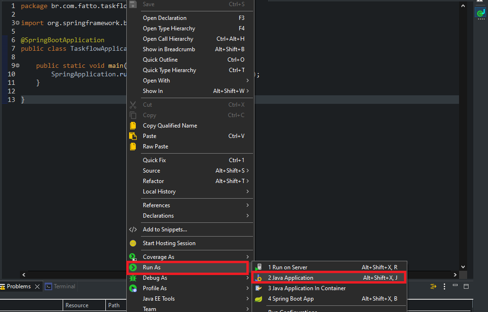

# TaskFlow API
TaskFlow é uma API para gerenciamento de tarefas, construída com Spring Boot e projetada para ser executada em um ambiente Docker. A API permite realizar operações de CRUD e reordenar tarefas de forma flexível.

## 🚀 Tecnologias Utilizadas
- **Java 17:** Linguagem principal para desenvolvimento.

- **Spring Boot 3.3.6:** Framework para desenvolvimento rápido e simplificado.

- **PostgreSQL:** Banco de dados relacional.

- **JPA/Hibernate** Para mapeamento objeto-relacional (ORM).

- **Docker:** Para facilitar a execução em contêineres.

- **Maven:** Gerenciador de dependências e build.

- **SLF4J:** Biblioteca de logging.

## 🎯 Endpoints Principais
| Método  | Endpoint                  | Descrição                           |
|---------|---------------------------|-------------------------------------|
| GET     | `/api/tarefas`            | Lista todas as tarefas.            |
| POST    | `/api/tarefas`            | Cria uma nova tarefa.              |
| PUT     | `/api/tarefas/{id}`       | Atualiza uma tarefa existente.     |
| DELETE  | `/api/tarefas/{id}`       | Exclui uma tarefa pelo ID.         |
| PUT     | `/api/tarefas/reordenar`  | Reordena as tarefas.               |

## 📝 Pré-requisitos
Certifique-se de ter as seguintes ferramentas instaladas no seu sistema:

- **IDE Eclipse ou Semelhante**

- **Banco de dados PostgreSQL** (Ou utilize um banco de dados na nuvem)

- **Postman** (Para testar os endpoints)

## 🛠️ Como rodar o serviço (IDE):

1)  Faça um clone do serviço ou baixe o .zip

2) Abra o serviço na sua IDE e entre nesse diretório: `src/main/resources/application.properties`

3) Substitua os valores: **${URL_DATABASE}**, **${USER_DATABASE}** e **${PASSWORD_DATABASE}** pelas credencias do seu banco de dados.

2) Agora entre nesse diretório: `src/main/java/br.com.fatto.taskflow/TaskflowApplication.java`

3) Clique com o botão direito em qualquer lugar **dentro do arquivo**: TaskflowApplication.java

4) Clique em: Run as -> Java Application.

## 🛠️ Como testar os endpoints (Postman):

Abra seu aplicativo de preferência, nesse caso, vou utilizar o Postman.

#### Criar Tarefa
- Método: `POST`

- Endereço: `http://localhost:8080/api/tarefas`

- Corpo da requisição: `Body`

- Formato dos dados: `raw`

- Json: {"nome":"tarefa 1","descricao":"","custo":10.00,"dataLimite":"25/11/2024","status":"Aberto" }

#### Pegar Tarefa
- Método: `GET`

- Endereço: `http://localhost:8080/api/tarefas`

#### Atualizar Tarefa
Antes de atualizar a terafa, **anote o id e a ordem** que aparece ao buscar todas as tarefas no método GET.

- Método: `PUT`

- Endereço: `http://localhost:8080/api/tarefas/id`

- Corpo da requisição: `Body`

- Formato dos dados: `raw`

- Json: {"nome":"tarefa 2","descricao":"Com descrição","custo":10.00,"dataLimite":"25/11/2024","ordem": 10,"status":"Aberto" }

#### Reordenar Tarefa
Antes de reordenar as terafas, **anote o id e a ordem** delas que aparecem ao buscar todas as tarefas no método GET.

- Método: `POST`

- Endereço: `http://localhost:8080/api/tarefas/reordenar`

- Corpo da requisição: `Body`

- Formato dos dados: `raw`

- Json: [{ "id": 1, "ordem": 2 },{ "id": 2, "ordem": 1 }]

#### Deletar Tarefa
Antes de deletar a terafa, **anote o id** dela que aparece ao buscar todas as tarefas no método GET.

- Método: `DELETE`

- Endereço: `http://localhost:8080/api/tarefas/id`

## ⚖️ Licença
Este projeto está licenciado sob a Licença MIT - veja o arquivo [LICENSE](LICENSE) para detalhes.

## 📞 Contato
**Autor:** Lucas Bomfim

**Whatsapp:** (81) 98199-2777

**E-mail:** lucasbomfimsobral@gmail.com